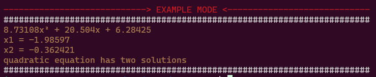
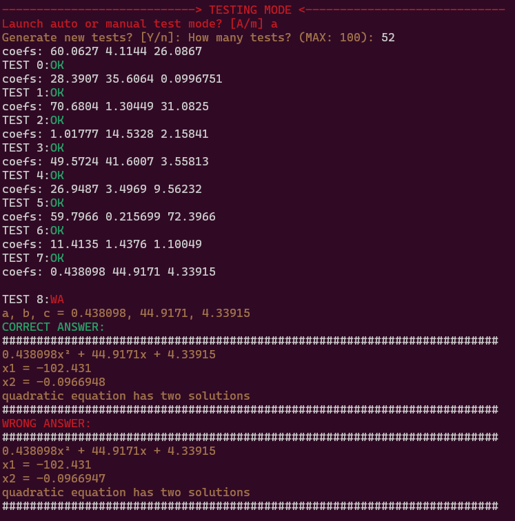
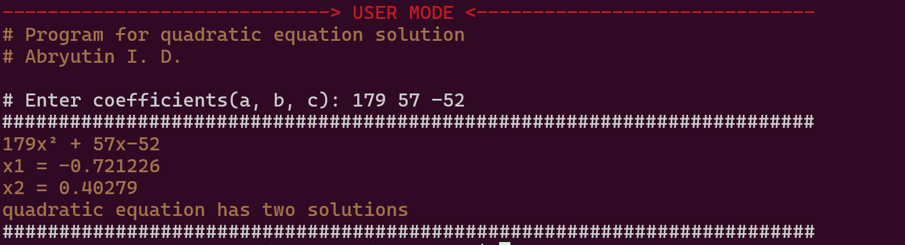
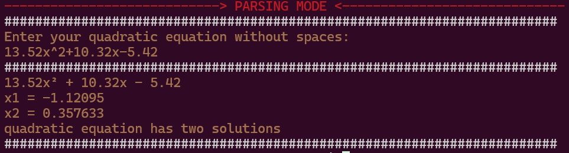

# Quadratic Equation Solver

Program solving quadratic equation


## Installation

```shell
git clone https://github.com/I1Va/quadr_equ.git

make
```

## Usage
```shell
make example
```


```shell
make testing
```


```shell
make launch
```


```shell
make parsing
```


## Features
1.  ***Auto testing***
    
  * Generates random quadratic equations into file `PATH_AUTO_TESTS` 
  * Reading tests from array
  * Main program testing by file tests

2.  ***Self-written random generator***

    Based on *Linear congruential generator*:

    $X_{i+1} = (aX_{i} + c) \mod m$

    With *Borland C/C++ constants* ([see other constants](https://en.wikipedia.org/wiki/Linear_congruential_generator))

    $m = 2^{32}, \; a = 22695477, \; c = 1;$
    Writes current seed into file located by `PATH_CUR_SEED[]` (see section: ([Settings](https://github.com/I1Va/quadr_equ/tree/progress?tab=readme-ov-file#settings)))

4. ***Color output***

## Settings

You can change system variables in file `quadr_equ/quadr_config.h`:

`PATH_AUTO_TESTS[]` — path to auto tests generating in testing mode 


`PATH_CUR_SEED[]` — path to file in which random generator will write current random number


`PATH_EXAMPLE[]` — path, where example quadratic equation is located (from example mode)

## Documentation
To create documentation by doxygen by command:

```shell
doxygen doxygen.config
```

Html file locates in `quadr_equ/html/index.html`


   


